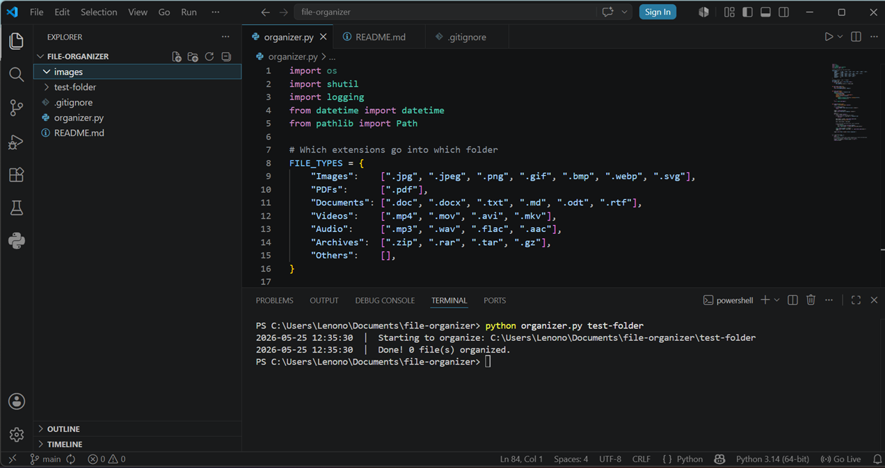

# 🗂️ Automated File Organizer

A simple Python script that automatically sorts messy folders into
neat subfolders — and logs every move with a timestamp.


---

## 📸 Demo



---

## 📁 What it does

Takes a messy folder like this:
Downloads/
holiday.jpg
invoice.pdf
notes.txt
song.mp3

And turns it into this automatically:
Downloads/
Images/       ← holiday.jpg
PDFs/         ← invoice.pdf
Documents/    ← notes.txt
Audio/        ← song.mp3
organizer.log ← record of every move
---

## 🚀 How to use

```bash
# Organize your Downloads folder (Windows)
python organizer.py C:/Users/YourName/Downloads

# Organize your Downloads folder (Mac/Linux)
python organizer.py ~/Downloads

# Organize the current folder
python organizer.py .
```

---

## 📋 Log output example
2024-06-01 14:22:01  |  Starting to organize: C:/Users/You/Downloads
2024-06-01 14:22:01  |  MOVED  holiday.jpg   -->  Images/
2024-06-01 14:22:01  |  MOVED  invoice.pdf   -->  PDFs/
2024-06-01 14:22:01  |  MOVED  notes.txt     -->  Documents/
2024-06-01 14:22:01  |  MOVED  song.mp3      -->  Audio/
2024-06-01 14:22:01  |  Done! 4 file(s) organized.

---

## 🗂️ File categories supported

| Folder | Extensions |
|---|---|
| Images | .jpg .jpeg .png .gif .bmp .webp .svg |
| PDFs | .pdf |
| Documents | .doc .docx .txt .md .odt .rtf |
| Videos | .mp4 .mov .avi .mkv |
| Audio | .mp3 .wav .flac .aac |
| Archives | .zip .rar .tar .gz |
| Others | anything else |

---

## ⚙️ Requirements

- Python 3.8 or newer
- No extra packages needed — uses only built-in Python

---

## 👤 Author

Made by Sonali Deshmukh 